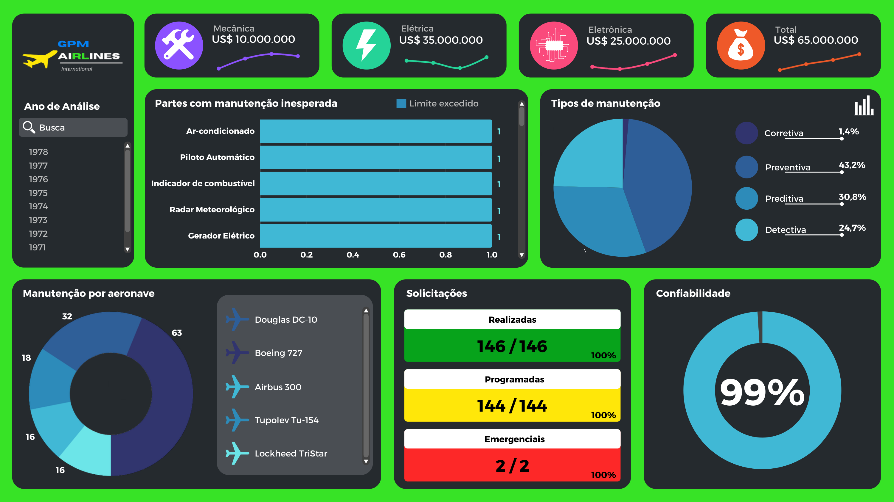
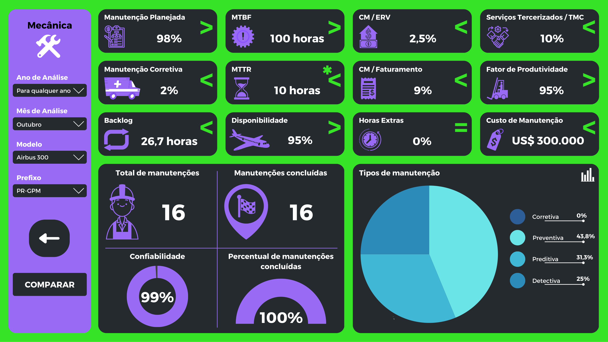
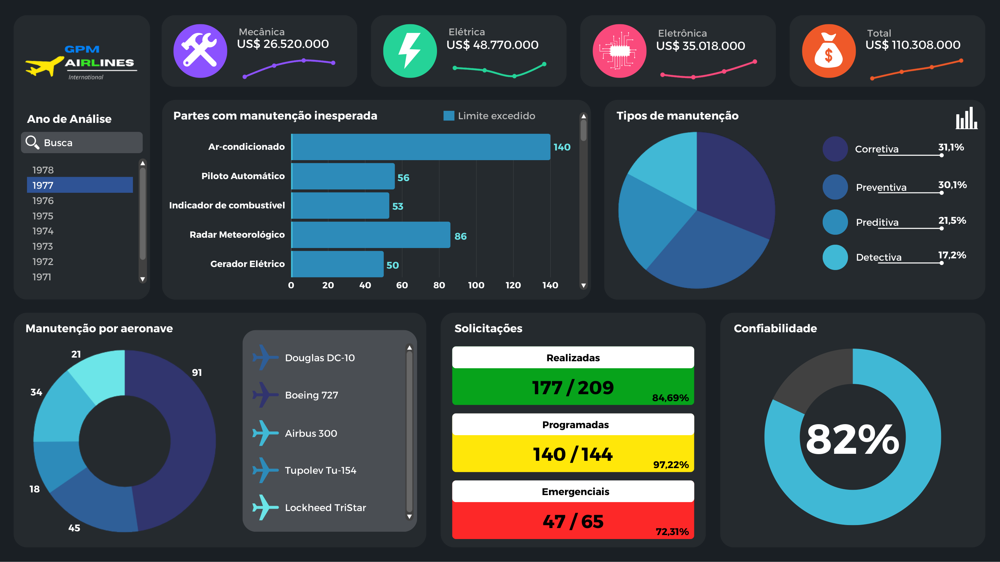
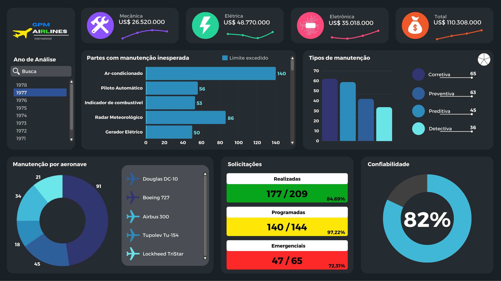
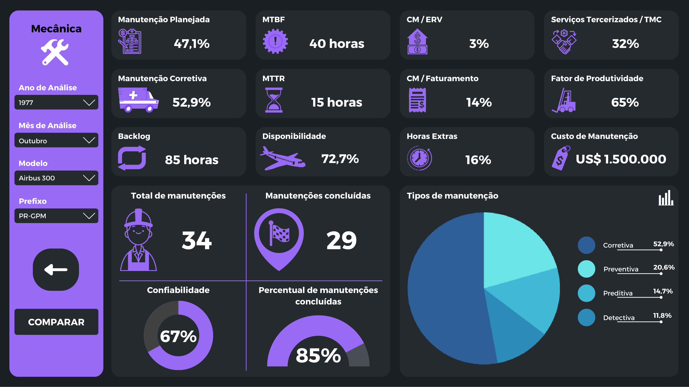
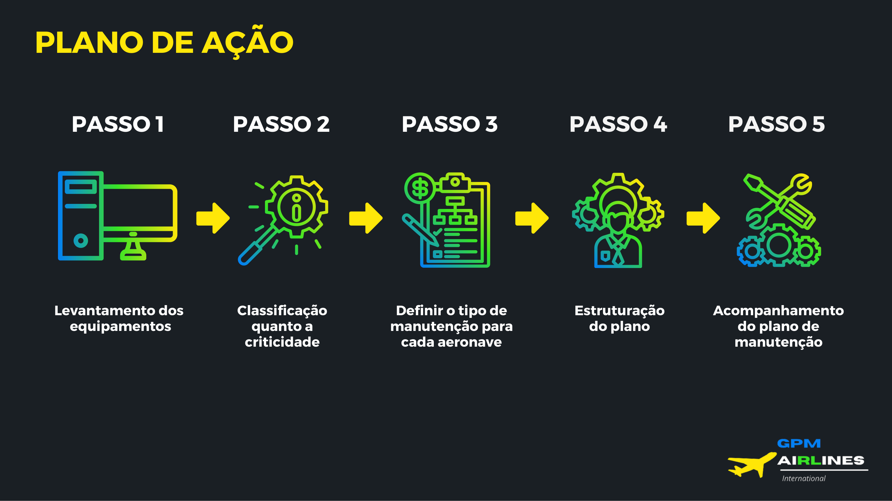

# Suggested Repository Description / Descrição Sugerida para o Repositório

---

# English Version

# GPM Airlines - Safe Transport Goal Progress & Maintenance Analytics

## About the Project
**GPM Airlines International** is a Brazilian airline operating across all countries in the Americas and five countries in Europe. Built upon a strong culture of inclusion, respect, and equality, GPM Airlines prioritizes education, technology, and sustainability as drivers for long-term operational excellence and aviation safety.

This repository presents the operational maintenance performance, fleet metrics, and strategic maintenance roadmap designed to ensure maximum flight safety and reliability.

### Key Pillars: Mission, Vision & Values
- **Mission:** Be the best airline to travel with, work for, and invest in.
- **Vision:** Be a sustainable company emphasizing technological education.
- **Values:** Safety, Low Cost, Eagles Team (*Time de Águias*), Intelligence, and Service.

### Fleet & Operations Covered
The analysis covers main fleet models across operating years:
- **Airbus 300**
- **Douglas DC-10**
- **Boeing 727**
- **Tupolev Tu-154**
- **Lockheed TriStar**

### Key Performance Indicators (KPIs) & Analytics
- **Types of Maintenance:** Preventive, Corrective, Predictive, and Detective maintenance.
- **Operational Metrics:** Mean Time Between Failures (MTBF), Mean Time To Repair (MTTR), Fleet Availability, Backlog hours, and Productivity Factor.
- **Financial & Cost Metrics:** Total Maintenance Cost (CM), CM relative to Replacement Asset Value (ERV), CM relative to Revenue, Overtime hours, and Third-party Service costs (TMC).
- **System Breakdown:** Analysis by mechanical, electrical, and electronic systems as well as component-level maintenance (air conditioning, autopilot, fuel indicator, weather radar, electrical generator).

### 5-Step Action Plan
1. **Step 1:** Equipment survey and inventory (*Levantamento dos equipamentos*).
2. **Step 2:** Criticality classification (*Classificação quanto à criticidade*).
3. **Step 3:** Maintenance strategy definition per aircraft (*Definir o tipo de manutenção para cada aeronave*).
4. **Step 4:** Plan structuring (*Estruturação do plano*).
5. **Step 5:** Maintenance plan monitoring (*Acompanhamento do plano de manutenção*).

### Project Team
- Gabriel Souto
- Geovanna Santos
- Pablo Matos
- Maria Fernanda
- Robert Gonçalves
- Lucas Veríssimo

---

## How to Open and View the Project

1. **PDF Document:**
   - Locate the `GPM aiRLines.pdf` file in the root directory.
   - Double-click to open it with any PDF reader (e.g., Adobe Acrobat, SumatraPDF) or drag and drop it into any modern browser (Google Chrome, Mozilla Firefox, Microsoft Edge).

2. **Rendered Screenshots:**
   - All 10 pages of the presentation PDF have been extracted into high-resolution PNG format inside the `assets/` folder (`assets/page_01.png` to `assets/page_10.png`).
   - You can review the complete slide deck below in the **Demonstration & Screenshots** section.

---

## Demonstration & Screenshots (Pages 1 - 10)

### Page 1 - Cover / Presentation Title

### Page 2 - Who We Are / Mission, Vision & Values

### Page 3 - Global Operations & Fleet Overview

### Page 4 - Maintenance Overview & Systems Distribution

### Page 5 - Comparative Maintenance Metrics Dashboard

### Page 6 - Fleet Reliability & Maintenance Breakdown

### Page 7 - Maintenance Costs by Category & Systems

### Page 8 - Detailed Fleet Operational Indicators & Comparison

### Page 9 - 5-Step Action Plan

### Page 10 - Project Team

---
---

# Versão em Português

# GPM Airlines - Progresso da Meta de Transporte Seguro & Dashboard de Manutenção

## Sobre o Projeto
A **GPM Airlines International** é uma companhia aérea brasileira presente em todos os países do continente americano e em cinco países da Europa. Pautada em uma cultura de inclusão, respeito e igualdade, a GPM Airlines acredita que a educação, tecnologia e sustentabilidade são a chave para o sucesso e a excelência operacional na aviação.

Este repositório reúne a apresentação do desempenho operacional de manutenção, indicadores da frota e o plano de ação estratégico para garantir o transporte seguro e a máxima confiabilidade das aeronaves.

### Pilares Estratégicos: Missão, Visão e Valores
- **Missão:** Ser a melhor companhia aérea para viajar, trabalhar e investir.
- **Visão:** Ser uma empresa sustentável dando ênfase na educação tecnológica.
- **Valores:** Segurança, Baixo Custo, Time de Águias, Inteligência e Servir.

### Frota Analisada
A análise contempla os principais modelos de aeronaves operadas:
- **Airbus 300**
- **Douglas DC-10**
- **Boeing 727**
- **Tupolev Tu-154**
- **Lockheed TriStar**

### Indicadores Chave de Desempenho (KPIs)
- **Tipos de Manutenção:** Preventiva, Corretiva, Preditiva e Detectiva.
- **Métricas Operacionais:** Tempo Médio Entre Falhas (MTBF), Tempo Médio Para Reparo (MTTR), Disponibilidade da Frota, Horas de Backlog e Fator de Produtividade.
- **Métricas Financeiras e Custos:** Custo Total de Manutenção (CM), CM sobre Valor de Troca do Ativo (ERV), CM sobre Faturamento, Horas Extras e Serviços Terceirizados (TMC).
- **Análise por Sistemas:** Avaliação por subsistemas mecânicos, elétricos e eletrônicos, além de partes específicas (ar-condicionado, piloto automático, indicador de combustível, radar meteorológico e gerador elétrico).

### Plano de Ação em 5 Passos
1. **Passo 1:** Levantamento dos equipamentos.
2. **Passo 2:** Classificação quanto à criticidade.
3. **Passo 3:** Definir o tipo de manutenção para cada aeronave.
4. **Passo 4:** Estruturação do plano.
5. **Passo 5:** Acompanhamento do plano de manutenção.

### Equipe do Projeto
- Gabriel Souto
- Geovanna Santos
- Pablo Matos
- Maria Fernanda
- Robert Gonçalves
- Lucas Veríssimo

---

## Como Abrir e Visualizar o Projeto

1. **Arquivo PDF:**
   - Localize o arquivo `GPM aiRLines.pdf` na raiz do repositório.
   - Abra-o diretamente com qualquer leitor de PDF (ex: Adobe Acrobat, SumatraPDF) ou arraste o arquivo para um navegador de sua preferência (Google Chrome, Mozilla Firefox, Microsoft Edge).

2. **Imagens das Páginas:**
   - Todas as 10 páginas da apresentação foram renderizadas em alta resolução na pasta `assets/` (`assets/page_01.png` até `assets/page_10.png`).
   - Você pode conferir a demonstração visual completa na seção de **Demonstração e Capturas de Tela** logo abaixo.

---

## Demonstração e Capturas de Tela (Páginas 1 a 10)

### Página 1 - Capa / Título da Apresentação

### Página 2 - Quem Somos / Missão, Visão e Valores

### Página 3 - Atuação Global e Visão da Frota

### Página 4 - Visão Geral de Manutenção e Distribuição por Sistemas

### Página 5 - Dashboard Comparativo de Indicadores de Manutenção

### Página 6 - Confiabilidade da Frota e Tipos de Manutenção

### Página 7 - Custos de Manutenção por Categoria e Sistemas

### Página 8 - Indicadores Operacionais Detalhados e Comparativos

### Página 9 - Plano de Ação em 5 Passos

### Página 10 - Equipe do Projeto

